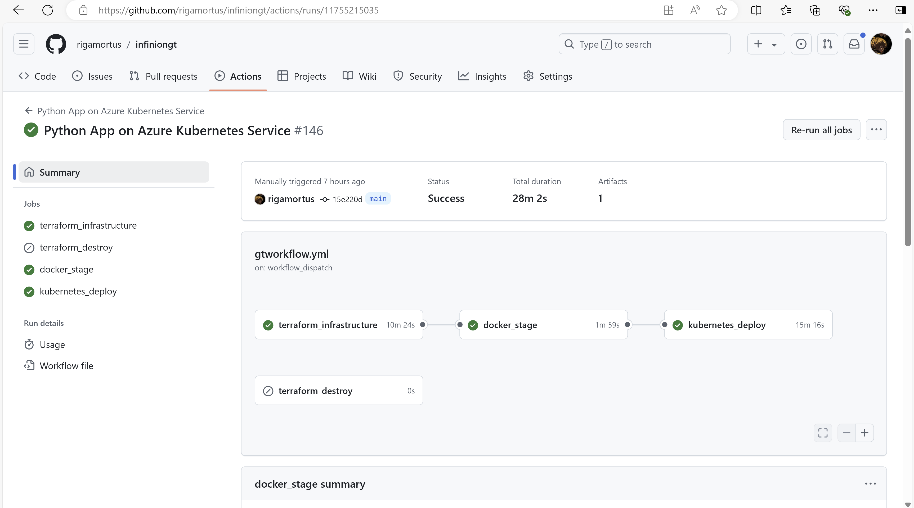

# Python Application on Azure Kubernetes Service

The aim of this project was to deploy a Python (Django) application on Azure Kubernetes Service. The infrastructure will be setup using Terraform modules and deployed with a GitHub Actions CI/CD pipeline. A Docker image will also be built and pushed to a private Azure Container Registry repository. Monitoring will also be implemented using Prometheus and Grafana, with custom alerts delivered to a Microsoft Teams channel using webhooks.

## Application Overview
The target application was written using the Django framework and can be found [here](https://github.com/Azure-Samples/msdocs-python-django-webapp-quickstart). For deployment to production, the application requires the generation of a secret key that is to be loaded as an environment variable. The secret key was generated with the command below:

```shell
python -c 'import secrets; print(secrets.token_hex())'
```

Although the above secret is loaded in its original iteration using a __.env__ file, I made the decision to alter the application code slightly and load it on my Kubernetes pods as an environment variable from a secret pulled from the Azure Key Vault. To achieve this,the __settings.py__ file was altered from its original form.

__Original Line__
```Python
SECRET_KEY = '1234567890'
```

__New Line__
```Python
import os
SECRET_KEY = os.environ["SECRET_KEY"]
```

## Azure Infrastructure
Terrafrom modules were used to create a number of Azure resources for this project:

- __VNets__ and __Subnets__: An Azure virtual network for my resources. Three subnets were created: __default__ subnet for my AKS cluster, __appgw__ subnet for my __Azure Application Gateway Ingress Controller__, and __privendp__ subnet for private endpoint communication with the Key Vault and ACR.

- __Azure Kubernetes Cluster__ and __Node Pools__: A private AKS cluster with one node pool was used. The cluster was made private to prevent the __api server__ from being reachable over the internet. System-assigned managed identites were created to enable authentication with my ACR and Key Vault. Azure CNI (which enables the pods to obtain IPv4 addresses from the VNet CIDR block) was my choice network plugin type. Nodes were also set to autoscaling.

- __Azure Container Registry__: Private container registry to house the Docker image that will be built. __ACR__ was accessible only by my the IP address of my GitHub Actions self-hosted runner. All other public IP addresses were are denied access by default.

- __Azure Key Vault__: Hosts the secret value required by the application.

- __Network Security Groups__: Control of network traffic to the cluster.

- __Private Endpoints__: Two private endpoints (one each for ACR and Key Vault) were created to enable private communication with the AKS cluster for image and secret pulling.

- __Role Assignments__: Designate access to the AKS cluster to enable permissions for image and secret pulling.

## Terraform Logic
A modular approach was adopted using Terraform. A single __env.yaml__ file acts as the singular source of truth for the configuration of each resource. The __env.yaml__ file is decoded using Terraform's __yamldecode__ function and passed as a locals block in my __locals.tf__ file. Terraform were also used to pass values in contexts were resource dependency exists. This approach allowed for easy scalability and modification of resources. A remote state backend using an Azure Blob container was also use to ensure safe locking of Terraform state files.

### __AKS__ Snippet:

__main.tf__
```HCL
resource "azurerm_kubernetes_cluster" "aks" {
  for_each                          = { for x in var.config.cluster : x.name => x }
  name                              = each.value.name
  location                          = each.value.location
  resource_group_name               = each.value.resource_group_name
  dns_prefix                        = each.value.dns_prefix
  kubernetes_version                = each.value.kubernetes_version
  private_cluster_enabled           = each.value.private_cluster_enabled
  role_based_access_control_enabled = each.value.rbac
  sku_tier                          = each.value.sku
  node_resource_group               = each.value.noderg
  key_vault_secrets_provider {
    secret_rotation_enabled = each.value.key_vault_secrets_provider.secret_rotation
  }
  default_node_pool {
    name       = each.value.default_node_pool.name
    node_count = each.value.default_node_pool.node_count
    vm_size    = each.value.default_node_pool.vm_size
    os_sku     = each.value.default_node_pool.os_sku
    vnet_subnet_id = var.subnet_ids[each.value.default_node_pool.vnet_subnet_id]
  }
  network_profile {
    network_plugin = each.value.network_profile.network_plugin
    pod_cidr       = each.value.network_profile.pod_cidr
    service_cidr   = each.value.network_profile.service_cidr
    dns_service_ip = each.value.network_profile.dns_service_ip
  }

  api_server_access_profile {
    authorized_ip_ranges = each.value.api_server_access_profile.authorized_ip_ranges
  }

  identity {
    type = each.value.identity.type
  }

  tags = each.value.tags
}

output "kubernetes_cluster_id" {
  value = { for name, cluster in azurerm_kubernetes_cluster.aks : name => cluster.id }
}

output "kubelet_identity" {
  value = { for name, cluster in azurerm_kubernetes_cluster.aks: name => cluster.kubelet_identity[0].object_id }
}
```

__variables.tf__
```HCL
variable "config" {
  type = object({
    cluster = list(object({
      name                    = string
      location                = string
      resource_group_name     = string
      dns_prefix              = string
      kubernetes_version      = string
      rbac                    = optional(bool)
      sku                     = optional(string)
      private_cluster_enabled = bool
      noderg                  = string
      key_vault_secrets_provider = object({
        secret_rotation = bool
      })
      network_profile = object({
        network_plugin = string
        pod_cidr       = optional(string)
        service_cidr   = string
        dns_service_ip = string
      })
      api_server_access_profile = object({
        authorized_ip_ranges = list(string)
      })
      identity = object({
        type = string
      })
      default_node_pool = object({
        name       = string
        node_count = string
        vm_size    = string
        os_sku     = string
        vnet_subnet_id = string
      })
      tags = optional(map(string))
    }))
  })
}

variable "subnet_ids" {
  type = map(string)
}
```

__env.yaml__
```YAML
aks-clusters:
  cluster:
    - name: "my-aks"
      location: "North Europe"
      resource_group_name: "myrg"
      dns_prefix: "riga-dns"
      kubernetes_version: "1.30"
      private_cluster_enabled: true
      key_vault_secrets_provider:
        secret_rotation: true
      noderg: "riga-aks-node"
      sku: "Free"
      rbac: false
      network_profile:
        network_plugin: "azure"
        service_cidr: "10.1.0.0/16"  # Non-overlapping range
        dns_service_ip: "10.1.0.10" 
      api_server_access_profile:
        enable_public_access: true
        authorized_ip_ranges: []
      identity:
        type: "SystemAssigned"
    .....
```
__locals.tf__
```Terraform
locals {
  env = yamldecode(file("env.yaml"))
}
```

__module.tf__
```HCL
module "clusters" {
  source     = "./modules/clusters"
  config     = local.env.aks-clusters
  subnet_ids = module.subnets.subnet_id
}
```

## GitHub Actions Workflow
A GitHub Actions CI/CD pipeline was implemented to deploy the application. The pipeline was split into three stages: a __terraform_infrastructure__ stage, a __docker__, and a __kubernetes_deploy__ stage. A elf-hosted runner (VM within the same private network as my cluster) was also configured. 

Azure CLI, Helm, Kubectl were installed on my self-hosted runner to enable it run commands in my workflow.

An OIDC managed identity with Contributor and RBAC Administrator roles was also created. A GitHub Actions secret was created to store the managed identity credentials needed to establish a connection to my Azure subscription.

### Terraform_Infrastructure Stage
This stage deployed the Terraform modules to Azure. It was run using a GitHub Actions provided runner of type __Ubuntu 22.04__ This stage comprised three run steps using the Bash/Azure CLI and three actions:
- __actions/checkout@v4__: Pulls repository content from my GitHub repository.
- __azure/login@v2__: Login and establish connection to Azure using the secrets of the OIDC managed identity that was previously created.
- __hashicorp/setup-terraform@v3__: Sets up Terraform on the runner

The run steps under this stage parsed the Azure credentials and set them as variables, set up the backend config for the Terraform state files, and apply the Terraform plan file to deploy the infrastructure.

Kubelet application id and object id were also set as outputs to be used in the __kubernetes_deploy__ stage.

### docker_stage
The Docker image for the application was built during this stage. A self-hosted runner (an Azure VM) within the same network as the AKS cluster and the ACR was also used. Using a self-hosted runner enabled image pushing since the ACR was made accessible only within the a private network. 

The Dockerfile for the build is detailed below:

- Python 3.13.0rc2 was selected as the base image and set as an argument. It was suggested by the Snyk stage during the build as a lightweight image with low vulnerability.

```
ARG PYTHON_VERSION=3.13.0rc2
FROM python:${PYTHON_VERSION}-alpine3.19 AS base
```
- The following tools were added during initial local builds to identify and isolate select capabilities required by the container to run. Capabilites enable containers to perform certain sensitive kernel operations and system calls. As such, restricting a container's capabilities helps improve its security posture. The necessary capabilities  needed for the container to run were identified and later incorporated in the Kubernetes stage.

```
RUN apk update && apk add --no-cache gcc libcap musl-dev strace 
```
- A non-privileged user was created and used to run the container. Password option, user information (gecos), and home directory options were disabled.

```Dockerfile
ARG UID=10001
RUN adduser \
    --disabled-password \
    --gecos "" \
    --home "/nonexistent" \
    --shell "/sbin/nologin" \
    --no-create-home \
    --uid "${UID}" \
    appuser
```
- Caching step to enable subsequent builds to be faster

```Dockerfile
RUN --mount=type=cache,target=/root/.cache/pip \
    --mount=type=bind,source=requirements.txt,target=requirements.txt \
    python -m pip install -r requirements.txt
```

- Container will listen on a non-privileged port (5000)

```Dockerfile
EXPOSE 5000
```

- Command step to run the application. Access logs and error logs are also made accessible.

```Dockerfile
CMD ["gunicorn", "--bind", "0.0.0.0:5000", "quickstartproject.wsgi:application", "--access-logfile", "-", "--error-logfile", "-"]
```

### SonarQube and Snyk
SonarQube and Snyk scanning were incorporated during the __docker_stage__ to identify potential vulnerability lapses. Snyk, in particular, helped suggest base image alternatives.

### Image Pushing
After the image was built, it was pushed to my ACR image repository using the __docker/build-push-action@v6__ action.

```YAML
- name: Build and Push
    uses: docker/build-push-action@v6
    with:
    context: ./msdocs-python-django-webapp-quickstart 
    push: true
    tags: rigamoracr.azurecr.io/flaskapp:latest
```


## kubernetes_deploy
The third and final stage was also ran using my Github Actions self-hosted runner. The private nature of the AKS cluster informed my choice of a self-hosted runner for this stage since the cluster's __apiserver__ is reachable only within the same network.

### Notes
- AKS cluster context was retrieved and set as the current context using the __azure/aks-set-context@v3__ action

```YAML
- name: Set AKS Context
  uses: azure/aks-set-context@v3
  with:
    resource-group: 'myrg'
    cluster-name: 'my-aks'
```

- Key Vault network rule exception and the secret needed for the pods to run were created using Azure CLI commands

```YAML
- name: Create Vault Secret
  run: |
    az keyvault network-rule add --name myrigamortuskeyvault  --ip-address ${{ vars.VM_IP }}
    az keyvault secret set --name SECRET-KEY --vault-name ${{ vars.KEYVAULT_NAME }} --value ${{ secrets.VAULT }}
    echo "TENANT_ID=$(az account show --query "tenantId" -o tsv)" >> $GITHUB_ENV
```

- Private DNS and VNet network links needed for image pulling and secret retrieval by the AKS cluster using the private endpoint were also created

```YAML
- name: Create Vault Secret
  run: |
    acrip1=$(az network private-endpoint show --name myacrendpoint --resource-group myrg --query "customDnsConfigs[0].ipAddresses" -o tsv)
    acrip2=$(az network private-endpoint show --name myacrendpoint --resource-group myrg --query "customDnsConfigs[1].ipAddresses" -o tsv)
    kvip=$(az network private-endpoint show --name mykvendpoint --resource-group myrg --query "customDnsConfigs[0].ipAddresses" -o tsv)
    .....
```

- Prometheus and Grafana for monitoring were installed in the cluster using Helm package manager

```YAML
- name: Prometheus Helm
    run: |
    helm repo add prometheus-community https://prometheus-community.github.io/helm-charts
    helm repo update
    helm install prometheus prometheus-community/kube-prometheus-stack --namespace monitoring --create-namespace
    kubectl --namespace monitoring get pods -l "release=prometheus"
```

- Azure Ingress Controller was enabled as a cluster add-on to expose the deployment.

```Shell
az aks addon enable -n my-aks -g myrg --addon ingress-appgw --appgw-subnet-cidr ${{ vars.SUBNET }}
```

- DNS A Records using the AGIC IPV4 value were also created.

```YAML
- name: DNS Records & Ingress
  run: |
    while true; do
        ING=$(kubectl get ing python-ingress -n default -o jsonpath='{.status.loadBalancer.ingress[0].ip}')
        if [ $? -eq 0 ] && [ -n "$ING" ]; then
        echo "Ingress IP retrieved successfully."
        break
        else
        echo "Waiting for ingress IP..."
        sleep 60
        fi
    done
    az network dns zone create -n davidcloud.site -g myrg
    az network dns record-set a add-record -g myrg -z davidcloud.site -n "@" -a "$ING"
    az network dns record-set a add-record -g myrg -z davidcloud.site -n grafana -a "$ING"
    az network dns record-set a add-record -g myrg -z davidcloud.site -n prometheus -a "$ING"
```
### Kubernetes YAML Manifests
A deployment with four pod replicas was my choice Kubernetes api-resource type for the application. Crucial details are noted below:

- Deployment with four pod replicas
- RollingUpdate strategy type with maxUnavailable and maxSurge specified
- NodeSelector attribute to deploy the pods on my worker nodes
- Resource limits for CPU and Memory usage
- Seccomp profile set to RuntimeDefault
- Restricted capabilities (NET_BIND_SERVICE & CHOWN only)
- Disabled privilege escalation
- Pods are run as nonroot and using an unprivileged user
- Root volumes set to readOnly
- ServiceAccountToken are not automatically mounted
- Secret value was mounted as an ephemeral volume from the Key Vault on the pods

Other api-resources created include: ClusterIP, SecretProviderClass, Ingress (__python_ingress__, __prometheus ingress__, __grafana ingress__), HorizontalPodAutoscaler, Certificates (LetsEncrypt), and ClusterIssuer.

## Monitoring
For proper monitoring, Grafana dashboards and Prometheus alert rules were created.

__Prometheus__


## Alerting
A webhook was integrated with a Teams channel (__Grafana Alerts__) for prompt delivery of alerts regarding the status of my application.

As a test, an alert rule that notifies me when CPU usage of my pods extends beyond 10% of resource limits was created.

__Query__

```promql
100 * (sum by (pod) (rate(container_cpu_usage_seconds_total{namespace="YOUR_NAMESPACE", container!="POD"}[5m]))
 / 
 sum by (pod) (kube_pod_container_resource_requests{namespace="YOUR_NAMESPACE", resource="cpu"})) > 10
 ```

 __Grafana Alerts__
 
 
 
 


 __Teams Notification__
 


## terraform_destroy
A __terraform_destroy__ stage was added to destroy resources.

```YAML
- name: Setup terraform
  uses: hashicorp/setup-terraform@v3
- name: Terraform Init & Destroy Plan
  run: |
    terraform init -backend-config="client_id=${{ env.client_id }}" \
                    -backend-config="client_secret=${{ env.client_secret }}" \
                    -backend-config="tenant_id=${{ env.tenant_id }}" \
                    -backend-config="subscription_id=${{ env.subscription_id }}"
    terraform plan -destroy -out destroyplan
    working-directory: tercluster/
- name: Teraform Apply
  run: terraform apply destroyplan
  working-directory: tercluster/
```


## Conclusion
The application was accessible via __davidcloud.site__. 


Prometheus & Grafana were also accessible via specified subdomains (__prometheus.davidcloud.site__ and __grafana.davidcloud.site__). 

### Final Workflow



